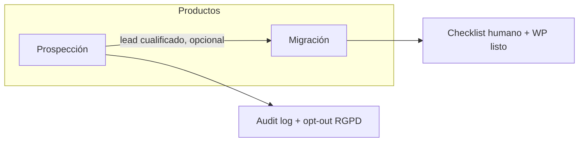
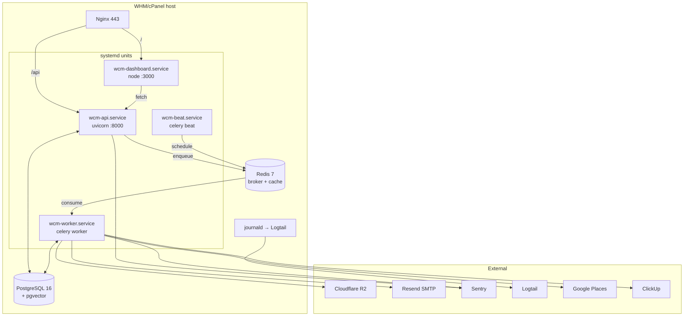
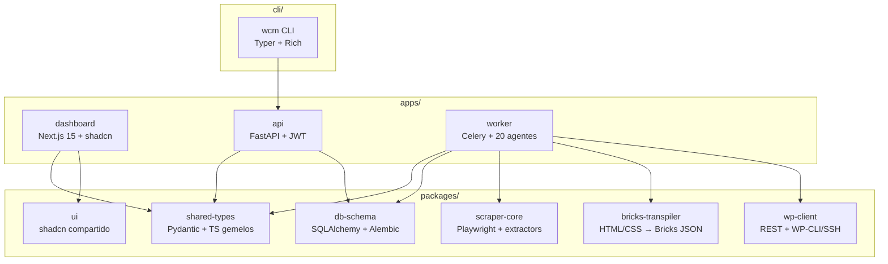
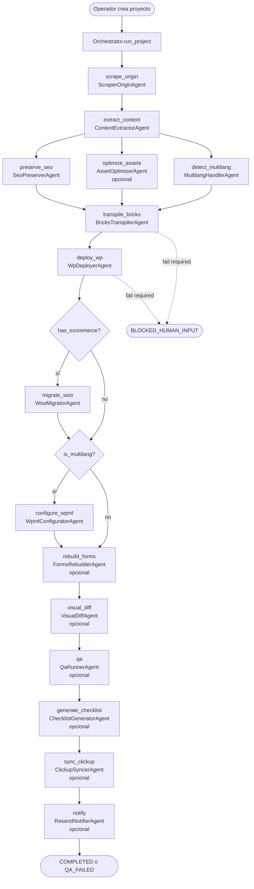
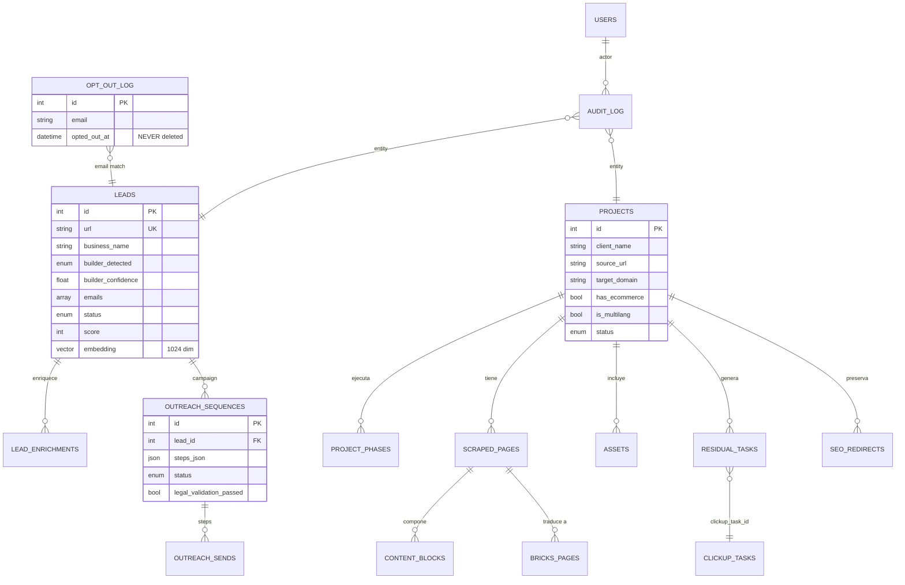
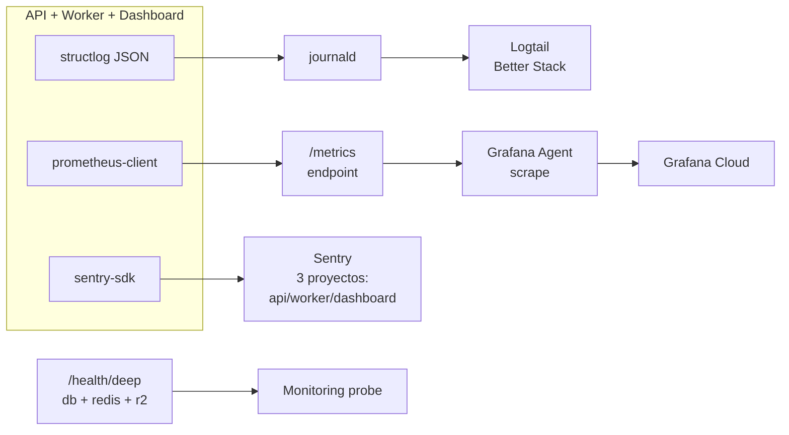

# Arquitectura — Webcafeína Migrator

> Documento vivo. Última revisión: Fase 14 (2026-05-13).

---

## 1. Visión general

Webcafeína Migrator es un monorepo que combina dos productos sobre la misma infraestructura:

- **Prospección**: descubrir empresas con webs Wix/Hostinger AI/Webflow → enriquecer datos públicos → preparar drafts de outreach LSSI-CE compliant para revisión humana.
- **Migración**: convertir esas webs a WordPress + Bricks Builder, preservando contenido/SEO/assets, generando un checklist humano de tareas residuales.

Comparten: BD, scraping core, cumplimiento legal, dashboard, observabilidad.



---

## 2. Topología de ejecución (producción)

Single-server WHM/cPanel (ADR-031). Toda la stack en un nodo AlmaLinux con systemd.



---

## 3. Componentes lógicos del código



---

## 4. Flujo de migración (15 fases del orchestrator)

Cada fase está implementada por un subagente que vive en `apps/worker/src/wcm_worker/agents/*.py`. El orchestrator (`pipeline.py`) las ejecuta en orden, con saltos condicionales por `condition_attr`.



Estados posibles del proyecto al final:
- `COMPLETED`: todas las fases OK.
- `QA_FAILED`: alguna fase opcional falló (no bloquea pero hay revisión humana).
- `BLOCKED_HUMAN_INPUT`: alguna fase requerida falló → operador interviene.

---

## 5. Flujo de prospección

Independiente del flujo de migración; el lead cualificado puede (opcional) convertirse en proyecto.

```mermaid
flowchart LR
    A[Operador lanza campaña<br/>sector + región + target] --> B[ProspectorAgent<br/>Google Places legacy]
    B --> C[Lead.DISCOVERED]
    C --> D[FingerprinterAgent<br/>scraper-core/fingerprint]
    D --> E[Lead.FINGERPRINTED + builder_detected]
    E --> F[EnricherAgent<br/>emails, phones, socials,<br/>embedding e5-large 1024-dim]
    F --> G[Lead.ENRICHED + score]
    G --> H{Operador<br/>aprueba?}
    H -->|sí| I[OutreachComposerAgent<br/>Jinja2 + validador legal v1.0]
    H -->|no| Z[Lead.DISCARDED]
    I --> J[OutreachSequence.DRAFT_PENDING_REVIEW]
    J --> K[Operador revisa<br/>en dashboard]
    K -->|approve| L[Sequence.READY]
    L --> M[OutreachSenderAgent<br/>Resend]
    M --> N[OutreachSend.SENT<br/>message_id persistido]
    N --> O[Webhook Resend<br/>opens/bounces/replies]
    O --> P[Send.{OPENED,BOUNCED,REPLIED}]
```

> El envío real **nunca** es automático: cada secuencia requiere transición manual `DRAFT_PENDING_REVIEW → READY → IN_PROGRESS`. Validación legal LSSI-CE se aplica en cada body (razón social + CIF + dirección + URL opt-out).

---

## 6. Modelo de datos (tablas principales)



Detalle completo en `packages/db-schema/src/wcm_db/models/` y migraciones Alembic en `packages/db-schema/alembic/versions/`.

---

## 7. Observabilidad (ADR-028/029)



- **Logs estructurados**: JSON en prod, ConsoleRenderer en dev. Stdlib puenteado para que uvicorn/sqlalchemy/httpx también emitan JSON.
- **Errores**: Sentry con `send_default_pii=False`. PII off por defecto.
- **Métricas**: HTTP requests + latency, Celery tasks + agent runs, custom counters.
- **Health**: `/health` simple (process up), `/ready` (db ping), `/health/deep` (db + redis + r2).

Todo perezoso: sin DSN/token, no se inicializa nada. Permite levantar la app en dev sin cuentas externas.

---

## 8. Cumplimiento legal

```mermaid
flowchart TD
    Discovery[Lead.DISCOVERED<br/>via Google Places] --> Legal{Base jurídica}
    Legal -->|art. 6.1.f RGPD<br/>+ art. 21.2 LSSI-CE| OK[OK contactar B2B]
    OK --> Compose[OutreachComposerAgent]
    Compose --> Validate{Validador legal v1.0}
    Validate -->|falta razón social/<br/>CIF/dirección/opt-out| Reject[Reject draft]
    Validate -->|todo OK| Persist[OutreachSequence<br/>DRAFT_PENDING_REVIEW]
    Persist --> Review[Operador revisa]
    Review --> Send[OutreachSenderAgent]
    Send --> DC[Doble check opt_out_log]
    DC -->|email en log| Abort[Abort + AuditLog]
    DC -->|email limpio| Resend[Resend API]
    Resend --> Persist2[OutreachSend.SENT<br/>+ AuditLog SEND<br/>legal_ground=6.1.f]

    Resend -.->|email link| Recipient[Receptor]
    Recipient -->|un clic| OptOut[/opt-out?token=...]
    OptOut --> Delete[Lead borrado<br/>+ opt_out_log forever]
```

Docs legales: `apps/api/legal/{tratamiento_datos_prospeccion,plantilla_aviso_legal_outreach,politica_retencion,procedimiento_brecha}.md`.

Retención automática vía Celery beat (`wcm.maintenance.retention_sweep` diario 03:30 Europe/Madrid):
- Leads DISCOVERED sin outreach > 12 meses → DELETE.
- Leads OUTREACH_SENT sin respuesta > 24 meses → DISCARDED → DELETE +6 meses.
- `opt_out_log` NUNCA se borra.
- `error_log` > 90 días → DELETE.

---

## 9. Subagentes runtime (worker) vs descriptors (.claude/)

Distinción importante (ADR-020):

| Carpeta | Propósito | Tipo |
|---|---|---|
| `.claude/agents/*.md` | Descriptores para Claude Code en build-time (con frontmatter Anthropic) | Markdown |
| `apps/worker/src/wcm_worker/agents/*.py` | Implementaciones runtime Python que ejecuta Celery | Código |

Los nombres coinciden por convención, pero viven en planos distintos.

**20 subagentes** runtime, todos heredando de `BaseAgent`:

| # | Nombre | Phase | Estado | Notas |
|---|---|---|---|---|
| 1 | orchestrator | (meta) | real | `pipeline.py` |
| 2 | scraper-origin | scrape_origin | real | BFS interno + httpx |
| 3 | content-extractor | extract_content | real | Wix/Hostinger/Webflow |
| 4 | seo-preserver | preserve_seo | real | meta+OG+canonical+hreflang |
| 5 | asset-optimizer | optimize_assets | **real Fase 10** | Pillow→WebP→R2 |
| 6 | multilang-handler | detect_multilang | real | `<html lang>` + counts |
| 7 | bricks-transpiler | transpile_bricks | real | wraps `packages/bricks-transpiler` |
| 8 | wp-deployer | deploy_wp | real | REST + WP-CLI/SSH |
| 9 | woo-migrator | migrate_woo | stub | Fase post-MVP |
| 10 | wpml-configurator | configure_wpml | stub | Fase post-MVP |
| 11 | forms-rebuilder | rebuild_forms | stub | Fase post-MVP |
| 12 | visual-diff | visual_diff | stub | Fase post-MVP |
| 13 | qa-runner | qa | stub | Fase post-MVP |
| 14 | checklist-generator | generate_checklist | stub | Fase post-MVP |
| 15 | clickup-syncer | sync_clickup | **real Fase 10** | REST v2 |
| 16 | resend-notifier | notify | **real Fase 10** | SDK Resend |
| 17 | prospector | (campaña) | **real Fase 9** | Google Places legacy |
| 18 | fingerprinter | (lead) | real | `scraper-core.fingerprint` |
| 19 | enricher | (lead) | **real Fase 9+10** | + embedding e5-large 1024d |
| 20 | outreach-composer | (lead) | **real Fase 9** | Jinja2 + validador legal |
| 21 | outreach-sender | (send) | **real Fase 10** | Resend + double-check opt-out |

(Sí, 21 — añadimos OutreachSender en Fase 10 como complemento del Composer.)

---

## 10. Decisiones arquitectónicas

32 ADRs vivos en [docs/decisiones.md](./decisiones.md). Más relevantes para entender la arquitectura:

- **ADR-001**: sin Docker.
- **ADR-010** (superseded por ADR-023): embeddings con sentence-transformers + e5-large 1024d.
- **ADR-017**: proxy layered free→paid.
- **ADR-019**: versionado `/api/v1/*` + opt-out fuera del prefijo.
- **ADR-020**: subagentes runtime vs descriptors `.claude/`.
- **ADR-022**: JetBrains Mono en toda la UI.
- **ADR-024**: Google Places API legacy (no New).
- **ADR-025/26/27**: Resend, R2 vía boto3, ClickUp `clickup_task_id`.
- **ADR-028/29**: observabilidad perezosa + Prometheus registry propio.
- **ADR-030/31**: systemd nativo + single-server WHM.
- **ADR-032**: e2e Playwright + pipeline test + visual regression.

---

## 11. Referencias

- Estado actual y avance: [`../STATE.md`](../STATE.md)
- Issues abiertos: [`../ISSUES.md`](../ISSUES.md)
- Despliegue: [`./despliegue.md`](./despliegue.md)
- Playbook operativo: [`./playbook-operativo.md`](./playbook-operativo.md)
- Migración (op): [`./migracion.md`](./migracion.md)
- Prospección (op): [`./prospeccion.md`](./prospeccion.md)
- Glosario: [`./glossary.md`](./glossary.md)
