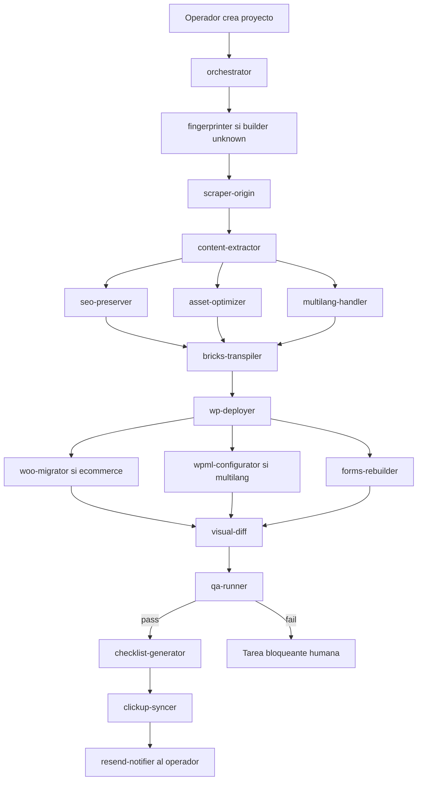
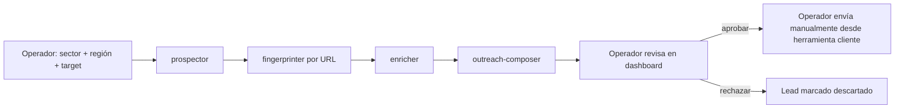

# Arquitectura — Webcafeína Migrator

> Documento vivo. Última revisión: Fase 0 (bootstrap).

---

## 1. Visión general

Webcafeína Migrator es un monorepo que combina dos productos sobre la misma infraestructura:

- **Prospección**: descubrir empresas con webs Wix/Hostinger/Webflow → enriquecer → preparar outreach personalizado para revisión humana.
- **Migración**: convertir esas webs a WordPress + Bricks Builder, preservando contenido/SEO/assets.

Comparten BD, infraestructura de scraping, cumplimiento legal y dashboard de operación.

---

## 2. Topología de ejecución (producción)

```
┌──────────────────── WHM/cPanel host ────────────────────┐
│                                                         │
│  Nginx (443, reverse proxy)                             │
│   ├── /     → 127.0.0.1:3000  (Next.js standalone)      │
│   └── /api  → 127.0.0.1:8000  (FastAPI / uvicorn)       │
│                                                         │
│  systemd                                                │
│   ├── webcafeina-api.service                            │
│   ├── webcafeina-worker.service     (Celery)            │
│   ├── webcafeina-beat.service       (Celery Beat)       │
│   └── webcafeina-dashboard.service                      │
│                                                         │
│  PostgreSQL 16 + pgvector                               │
│  Redis 7  (broker Celery + cache)                       │
│  Logs:  journalctl                                      │
│                                                         │
└─────────────────────────────────────────────────────────┘

External:
  - Cloudflare R2 (assets, screenshots, exports)
  - Resend (notificaciones internas)
  - Sentry, Logtail (observabilidad)
  - Bright Data (proxies prospección)
  - 2captcha (fallback)
  - Google Maps Places (descubrimiento)
  - ClickUp (gestión tareas residuales)
```

---

## 3. Componentes lógicos

```
┌─────────────────────────────────────────────────────────────────┐
│                       Dashboard (Next.js 15)                    │
│  /leads  /projects  /campaigns  /errors  /settings              │
└──────────────────────────────┬──────────────────────────────────┘
                               │ HTTP REST + WebSocket (status)
                               ▼
┌─────────────────────────────────────────────────────────────────┐
│                      API (FastAPI)                              │
│  endpoints CRUD + webhook ClickUp + opt-out (RGPD)              │
└─────────────┬───────────────────────────────────┬───────────────┘
              │ Celery (Redis broker)             │ SQLAlchemy
              ▼                                   ▼
┌────────────────────────────┐         ┌────────────────────────┐
│        Worker pool         │         │  PostgreSQL + pgvector │
│  ┌──────────────────────┐  │         └────────────────────────┘
│  │ orchestrator agent   │  │
│  │ prospector / migrator│  │
│  │ +18 subagentes más   │  │
│  └──────┬───────┬───────┘  │
└─────────┼───────┼──────────┘
          │       │
          │       │  external calls
          ▼       ▼
   ┌─────────┐  ┌──────────────┐  ┌────────┐  ┌──────────┐  ┌────────┐
   │   R2    │  │ Resend / API │  │ ClickUp │  │ WP target │  │ BrightD│
   └─────────┘  └──────────────┘  └────────┘  └──────────┘  └────────┘
```

---

## 4. Flujo de migración (detallado)



## 5. Flujo de prospección (detallado)



> El envío real de outreach **nunca** lo hace la herramienta automáticamente. Solo prepara, no envía.

---

## 6. Datos: tablas críticas

(detalle completo en [packages/db-schema/README.md](../packages/db-schema/README.md))

- `leads` (vector embedding)
- `projects`, `project_phases`
- `scraped_pages`, `content_blocks`, `assets`, `bricks_pages`
- `residual_tasks`, `seo_redirects`
- `audit_log`, `error_log`

---

## 7. Observabilidad

- **Logs estructurados** (structlog JSON) → stdout → journald → Logtail.
- **Errores**: Sentry (DSN por proceso).
- **Métricas operacionales** en dashboard (`/`):
  - Proyectos activos / completados últimos 30 días
  - Visual diff promedio por proyecto
  - Coste Bright Data / 2captcha / Resend mensual
  - Latencia p95 API
  - Cola Celery (jobs pending / failed)

---

## 8. Cumplimiento legal

- Toda función con datos personales pasa por skill `gdpr-compliance`.
- Outreach LSSI-CE compliant (bloque legal obligatorio en cada email).
- Opt-out funcional con URL pública firmada.
- TTL 12 meses para leads sin consentimiento.
- Documentos RGPD en `apps/api/legal/` (Fase 9).

---

## 9. Despliegue

- **Sin Docker.** Procesos nativos systemd.
- Provisionamiento inicial: scripts `infra/whm-setup/01..10`.
- Deploy continuo: GitHub Actions → SSH al servidor → `infra/deploy/deploy.sh`.

Ver [docs/despliegue.md](./despliegue.md).

---

## 10. Subagentes y skills

| Subagentes | Skills |
|---|---|
| orchestrator | (todas indirectas) |
| prospector, fingerprinter, enricher, outreach-composer | google-maps-scraper, directory-scraper, builtwith-fingerprint, lsr-fingerprint, gdpr-compliance, proxy-rotation, captcha-handling |
| scraper-origin, content-extractor | wix-extraction, hostinger-ai-extraction, webflow-extraction |
| seo-preserver, asset-optimizer | seo-audit, image-pipeline, r2-uploader |
| bricks-transpiler | bricks-json-schema |
| wp-deployer, woo-migrator, wpml-configurator, forms-rebuilder | wp-rest-bulk, wpcli-ssh |
| visual-diff, qa-runner | visual-diff-pixelmatch |
| checklist-generator, clickup-syncer | clickup-task-creator, resend-notifier |
| deployer-systemd | systemd-service-generator |
| multilang-handler | (lectura datos) |

---

## 11. Decisiones arquitectónicas

Ver [docs/decisiones.md](./decisiones.md) (ADR ligero).
